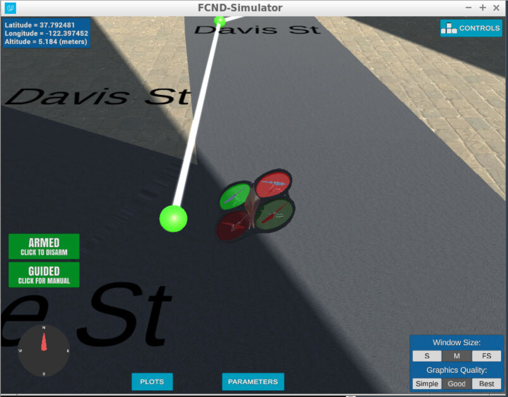
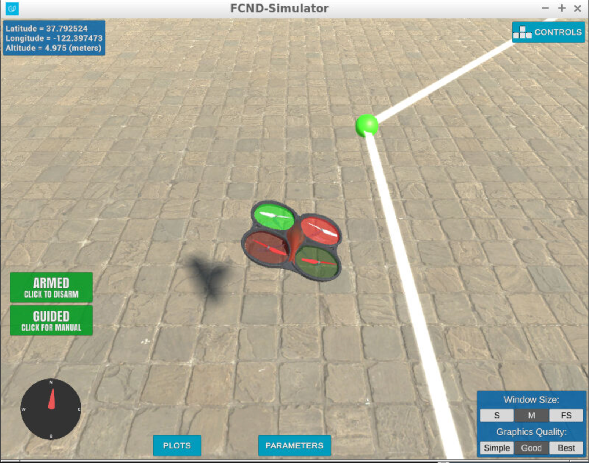
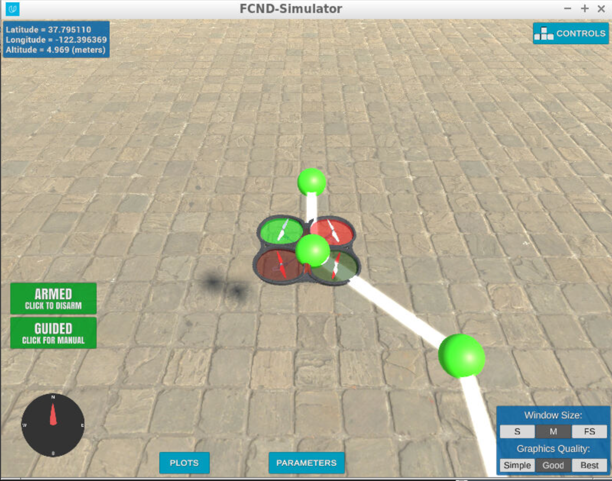

## Project: 3D Motion Planning

---
### Writeup

### Explain the Starter Code

#### 1. Explain the functionality of what's provided in `motion_planning.py` and `planning_utils.py`

The main difference between the motion planning and backyard flyer project is the inclusion of planning stage before drone takes off.

The motion_planning.py consists of following methods in order for drone to reach its goal.
1. It consists of series of states in which a drone can be in like drone is in takeoff stage or going to next waypoint or landing stage.
2. It also consists of other utility functions which were implemented in backyard flyer project like receiving callbacks from drone simulator informing the drone flight computer what is the current position of drone, current velocity and current state. These callbacks determine what task to execute next. For example, if drone reaches the armed state, it goes into planning stage where it plans its path from start to goal location before taking off.
3. The main function of this project is the plan_path() function which performs the following steps to calculate a path from start to goal location:
    1. It reads the first line from colliders.csv and sets the global home position to the longitude and latitude specified in this first line.
    2. It then reads the 2.5D map specified in colliders.csv remaining lines.
    3. It then creates a grid of the world using the location of buildings specified in the above file. The free space of grid is marked as zero while the space occupied by buildings are marked as 1.
    4. The functions then uses A* algorithm to find a path from the start location to goal location for the drone avoiding the obstacles. It returns the path in terms of series of waypoints for drone to travel.
    5. It then prunes the path to remove unnecessary waypoints which are in straight line so as to avoid drone to stop in between and continue on same straight path.
    6. This concludes the path planning phase and drone can now takeoff.

The planning_utils.py consists of following methods:
1. The first function is the create_grid(0 function which creates a grid of the world provided with colliders.csv or any other city data. It converts a 3D map into a 2.5D map which considerably saves space. It creates a 2.5D map by looking at the drone altitude and determining if any of the obstacles height is less than drone's height it will mark the grid space as available.
2. The second function consists of valid actions which essentially provides all the path a drone can take given its current position. It provides drone with choice of North, South, East, West, North West, North East, South West and South East locations.
3. The third function is the heuristic function which just gives the distance between the current position and the goal position. This helps in determining the shortest path to goal location during path planning.
4. The last function is the a_star() function which performs the following steps:
  1. A* uses a variation of breadth first search algorithm to find the shortest path from start to goal location. It initializes a priority queue based on the length of distance from one node to goal node. It also maintains a list of all the visited nodes starting with the start node.
  2. At each iteration it extracts the lowest priority element (node with lowest distance to goal) and computes cost to all the neighbors of this node and add them to back to queue.
  3. It continues doing step 2 until either queue is empty or goal node has been reached.
  4. If goal node is found, it retraces path back from goal node to start node and returns the total cost for this shortest path.

### Implementing Your Path Planning Algorithm

#### 1. Set your global home position
The global home location is set using the set_home_position() method provided by Udacidrone API. The coordinates for home location are provided in the colliders.csv first line. The first line read from the file is first split with comma character and the resulting two strings are again split with space character (motion_planning.py() line 127-137).

The below image shows the drone set to home location provided from colliders.csv file.

#### 2. Set your current local position
I then used Udacidrone API global_to_local() method to convert the geodetic coordinates (latitude, longitude) into local coordinates with the help of drone's current global position provided by Udacidrone API (motion_planning.py() line 140-145).

#### 3. Set grid start position from local position
The drone start position is set by using the local coordinates from step-2 above and offsetting them by map's north and east offset (motion_planning.py() line 162).

#### 4. Set grid goal position from geodetic coords
The drone's goal location in geodetic coordinates are set in the initialization method of Motion planning class (motion_planning.py() line 36-37). The goal geodetic coordinates are then converted to local coordinates using the same global_to_local() method (motion_planning.py() line 169-170).

#### 5. Modify A* to include diagonal motion (or replace A* altogether)
To include diagonal motion planning into A* algorithm, I modified the Actions class described in planning_utils.py() file (line 45-106). Here in the action class, to include diagonal motion, I added the North West, North East, South West and South East directions as also possible directions in which the drone can move. These paths have a cost of sqrt(2). I also modified the valid_action() method of Action class. For all the points in diagonal motion that lie outside the boundary of the grid or hit an obstacle, I removed that particular action from the list of valid actions. A* algorithm uses this valid_actions() method to find all possible neighbors of the node with its associated cost.

#### 6. Cull waypoints
I used the collinearity check to remove unnecessary waypoints from a straight path. First all the points are added to a list of pruned paths. Then for each 3 consecutive points in pruned paths, collinearity check is done. The idea is to check if the matrix formed by these 3 points have a determinant of zero. If a matrix has determinant of zero, then these 3 points are considered to lie in same straight path. The second point from these 3 points is removed from list of pruned paths. At the end we are left only with those points that require drone to change its location or heading.

The below image shows drone executing flight plan with unnecessary waypoints removed from the path.

### Execute the flight
#### 1. Does it work?
It works!

The below image shows drone reaching its final destination.

